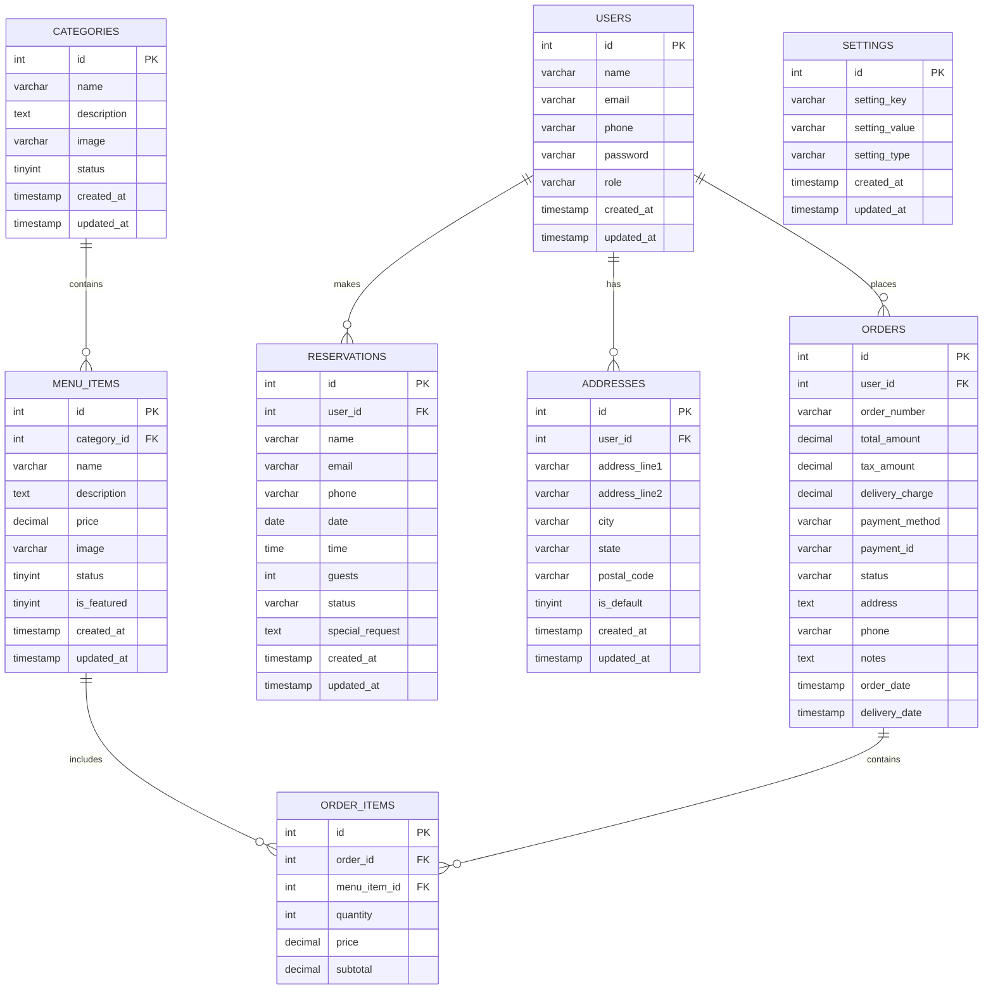

# HungryHeaven - Complete Project Documentation

## Table of Contents

1. [Project Overview](#1-project-overview)
2. [Features and Functionality](#2-features-and-functionality)
3. [Technical Architecture](#3-technical-architecture)
4. [Database Schema](#4-database-schema)
5. [Site Structure](#5-site-structure)
6. [Installation and Setup](#6-installation-and-setup)
7. [User Guide](#7-user-guide)
8. [Admin Guide](#8-admin-guide)
9. [API Integrations](#9-api-integrations)
10. [Security Implementations](#10-security-implementations)
11. [Development Notes](#11-development-notes)
12. [Troubleshooting](#12-troubleshooting)

## 1. Project Overview

HungryHeaven is a comprehensive restaurant management system with integrated online ordering capabilities. The system provides both customer-facing interfaces for ordering food and making reservations, as well as administrative tools to manage menu items, orders, reservations, and system settings.

### Project Objectives

- Create a user-friendly online food ordering system
- Provide restaurant administrators with tools to manage their business
- Implement secure payment processing with Razorpay integration
- Support multiple order types (delivery and table orders)
- Enable table reservation functionality
- Maintain clear separation between admin and customer interfaces

### Technology Stack

- **Frontend**: HTML5, CSS3, Bootstrap 5, JavaScript, jQuery
- **Backend**: PHP 7.4+
- **Database**: MySQL 5.7+
- **Payment Gateway**: Razorpay
- **Additional APIs**: 
  - Google Maps for address selection
  - Font Awesome for icons

## 2. Features and Functionality

### Customer Features

1. **User Account Management**
   - Registration and login
   - Profile management
   - Password recovery
   - Address management
   - Order history

2. **Menu Browsing**
   - Category-based menu organization
   - Item details with images, descriptions, and pricing
   - Search functionality
   - Featured items section

3. **Shopping Cart**
   - Add/remove items
   - Adjust quantities
   - View subtotal, tax, and delivery charges
   - Save cart between sessions

4. **Checkout Process**
   - Multiple payment methods (Cash on Delivery, Razorpay)
   - Address selection or input
   - Order notes and special instructions
   - Order summary review

5. **Reservation System**
   - Date and time selection
   - Party size specification
   - Special requests
   - Reservation confirmation

6. **Order Tracking**
   - View order status
   - Order history with details
   - Reorder functionality

### Admin Features

1. **Dashboard**
   - Order statistics
   - Sales metrics
   - Recent activity
   - Quick access to common functions

2. **Menu Management**
   - Category creation and management
   - Menu item creation and management
   - Image uploads
   - Pricing and availability controls

3. **Order Management**
   - View and filter orders
   - Update order status
   - Order details and history
   - Customer information

4. **Reservation Management**
   - View and manage reservations
   - Approve or reject requests
   - Table assignment
   - Customer communication

5. **System Settings**
   - Restaurant information
   - Delivery charges configuration
   - Tax settings
   - Payment gateway configuration
   - User interface customization

6. **User Management**
   - Admin user creation and management
   - Role-based access control
   - Password management

7. **Reporting**
   - Sales reports
   - Order statistics
   - Customer analytics
   - Export capabilities

## 3. Technical Architecture

### System Architecture

HungryHeaven follows a traditional PHP web application architecture:

- **Presentation Layer**: HTML templates with PHP integration, using Bootstrap for responsive design
- **Application Layer**: PHP scripts handling business logic, form processing, and database interactions
- **Data Layer**: MySQL database storing all application data

### Directory Structure

```
HungryHeaven/
├── admin/                  # Admin site files
│   ├── categories.php      # Category management
│   ├── dashboard.php       # Admin dashboard
│   ├── index.php           # Admin index redirect
│   ├── login.php           # Admin login
│   ├── logout.php          # Admin logout
│   ├── menu_items.php      # Menu management
│   ├── orders.php          # Order management
│   ├── profile.php         # Admin profile management
│   ├── register_admin.php  # Admin registration
│   ├── reports.php         # Sales/order reports
│   ├── reservations.php    # Reservation management
│   ├── settings.php        # System settings
│   └── users.php           # User management
│
├── customer/               # Customer site files
│   ├── about.php           # About us page
│   ├── addresses.php       # Address management
│   ├── cart.php            # Shopping cart
│   ├── checkout.php        # Order checkout
│   ├── contact.php         # Contact page
│   ├── index.php           # Customer home redirect
│   ├── login.php           # Customer login
│   ├── logout.php          # Customer logout
│   ├── menu.php            # Menu browsing
│   ├── orders.php          # Order history
│   ├── profile.php         # Customer profile
│   ├── register.php        # Customer registration
│   └── reservation.php     # Table reservations
│
├── includes/               # Shared files
│   ├── db_connection.php   # Database connection
│   ├── footer.php          # Footer template
│   ├── functions.php       # Common functions
│   ├── header.php          # Header template
│   └── navbar.php          # Navigation menu
│
├── assets/                 # Static assets
│   ├── css/                # CSS files
│   ├── images/             # Image files
│   └── js/                 # JavaScript files
│
├── uploads/                # Uploaded content
│   ├── categories/         # Category images
│   └── menu/               # Menu item images
│
├── docs/                   # Documentation
├── index.php               # Main site entry
└── README.md               # Project overview
```

### Code Organization

- **Separation of Concerns**: Admin and customer functionality are separated into different directories
- **Shared Components**: Common functions, database connection, and templates are in the includes directory
- **Reusable Templates**: Header, footer, and navigation elements are modularized
- **Asset Management**: Static assets are organized by type
- **Upload Management**: User-uploaded content is separated by category

### Session Management

The application uses PHP sessions for user authentication and state management, with careful separation between admin and customer sessions:

- **Admin Sessions**: Uses `$_SESSION['admin_user_id']` and related variables
- **Customer Sessions**: Uses `$_SESSION['user_id']` and related variables

This separation prevents session conflicts when admin and customer sections are accessed from the same browser.

## 4. Database Schema

### Entity Relationship Diagram

The database follows a relational model with the following key entities and relationships:



### Table Descriptions

1. **users**: Stores user account information including both customers and administrators
2. **categories**: Food categories used to organize menu items
3. **menu_items**: Individual food items available for ordering
4. **orders**: Customer orders with payment and delivery information
5. **order_items**: Individual items within each order
6. **reservations**: Table reservation requests
7. **addresses**: Customer delivery addresses
8. **settings**: System configuration settings

### Relationship Details

1. **USERS to ORDERS**: One-to-Many
2. **USERS to RESERVATIONS**: One-to-Many
3. **USERS to ADDRESSES**: One-to-Many
4. **CATEGORIES to MENU_ITEMS**: One-to-Many
5. **MENU_ITEMS to ORDER_ITEMS**: One-to-Many
6. **ORDERS to ORDER_ITEMS**: One-to-Many

## 5. Site Structure

### Site Map

The application has two main sections - the customer-facing website and the admin control panel:

```mermaid
graph TD
    %% Main Entry Points
    Main[Main Index Page]
    AdminLogin[Admin Login]
    
    %% Customer Section
    Main --> CustomerHome[Customer Homepage]
    CustomerHome --> CustomerMenu[Menu Browsing]
    CustomerHome --> CustomerAbout[About Us]
    CustomerHome --> CustomerContact[Contact]
    CustomerHome --> CustomerReservation[Table Reservation]
    
    %% Customer Account Flow
    CustomerHome --> CustomerLogin[Customer Login]
    CustomerLogin --> CustomerRegister[Customer Registration]
    CustomerLogin --> CustomerProfile[Customer Profile]
    CustomerProfile --> CustomerAddresses[Manage Addresses]
    CustomerProfile --> CustomerOrders[Order History]
    
    %% Order Flow
    CustomerMenu --> CustomerCart[Shopping Cart]
    CustomerCart --> CustomerCheckout[Checkout]
    CustomerCheckout --> CustomerPayment[Payment Options]
    CustomerPayment --> OrderComplete[Order Complete]
    CustomerPayment -->|Cash on Delivery| OrderComplete
    CustomerPayment -->|Razorpay| RazorpayGateway[Razorpay Gateway] --> OrderComplete
    
    %% Admin Section
    AdminLogin --> AdminDashboard[Admin Dashboard]
    
    %% Admin Menu Management
    AdminDashboard --> AdminCategories[Category Management]
    AdminCategories -->|Add| CategoryAdd[Add Category]
    AdminCategories -->|Edit| CategoryEdit[Edit Category]
    AdminCategories -->|Delete| CategoryDelete[Delete Category]
    
    AdminDashboard --> AdminMenuItems[Menu Item Management]
    AdminMenuItems -->|Add| MenuItemAdd[Add Menu Item]
    AdminMenuItems -->|Edit| MenuItemEdit[Edit Menu Item]
    AdminMenuItems -->|Delete| MenuItemDelete[Delete Menu Item]
    
    %% Admin Order Management
    AdminDashboard --> AdminOrders[Order Management]
    AdminOrders --> ViewOrder[View Order Details]
    AdminOrders --> UpdateStatus[Update Order Status]
    
    %% Admin Reservation Management
    AdminDashboard --> AdminReservations[Reservation Management]
    AdminReservations --> ApproveReservation[Approve Reservation]
    AdminReservations --> DeclineReservation[Decline Reservation]
    
    %% Admin Settings
    AdminDashboard --> AdminSettings[System Settings]
    AdminSettings --> GeneralSettings[General Settings]
    AdminSettings --> DeliverySettings[Delivery Settings]
    AdminSettings --> PaymentSettings[Payment Settings]
    AdminSettings --> TaxSettings[Tax Settings]
    AdminSettings --> SocialMediaSettings[Social Media Settings]
    
    %% Admin User Management
    AdminDashboard --> AdminUsers[User Management]
    AdminUsers --> AddAdmin[Add Admin User]
    AdminUsers --> EditAdmin[Edit Admin User]
    AdminUsers --> DeleteAdmin[Delete Admin User]
    
    %% Admin Reports
    AdminDashboard --> AdminReports[Reports]
    AdminReports --> SalesReport[Sales Reports]
    AdminReports --> OrderReport[Order Reports]
    AdminReports --> CustomerReport[Customer Reports]
    
    %% Admin Profile
    AdminDashboard --> AdminProfile[Admin Profile]
    AdminProfile --> UpdateAdminProfile[Update Profile]
    AdminProfile --> ChangePassword[Change Password]
```



### User Flows

#### Customer Order Flow

1. Browse menu items
2. Add items to cart
3. View and adjust cart
4. Proceed to checkout
5. Enter or select delivery address
6. Choose payment method
7. Complete payment (if online)
8. Receive order confirmation

#### Admin Order Management Flow

1. View incoming orders
2. Review order details
3. Update order status
4. Process payment (if COD)
5. Assign for delivery
6. Mark as delivered/completed

## 6. Installation and Setup

### System Requirements

- PHP 7.4 or higher
- MySQL 5.7 or higher
- Web server (Apache, Nginx, etc.)
- Required PHP extensions:
  - mysqli
  - gd (for image processing)
  - mbstring
  - curl (for payment gateway integration)
  - json
  - session

### Installation Steps

1. **Download and Extract Files**
   - Clone the repository or extract the zip archive to your web server directory

2. **Create Database**
   - Create a MySQL database named `hungryheaven`
   - Import the database schema from `database/hungryheaven.sql`

3. **Configure Database Connection**
   - Edit `includes/db_connection.php` with your database credentials:
   ```php
   $servername = "localhost";
   $username = "root";  // Your database username
   $password = "";      // Your database password
   $dbname = "hungryheaven";
   ```

4. **Set Directory Permissions**
   - Ensure the `uploads` directory and its subdirectories are writable:
   ```
   chmod -R 755 uploads/
   ```

5. **Configure Razorpay (Optional)**
   - Sign up for a Razorpay account
   - Get your API keys (test or live)
   - Configure them in the Admin Settings

6. **Access the Application**
   - Customer Interface: http://localhost/HungryHeaven/
   - Admin Panel: http://localhost/HungryHeaven/admin/login.php
   - Default admin credentials:
     - Email: admin@hungryheaven.com
     - Password: password

### Configuration Options

The system can be configured through the admin settings panel:

1. **General Settings**
   - Restaurant name, logo, contact information
   - Business hours
   - Email notifications

2. **Delivery Settings**
   - Delivery charges
   - Minimum order amount for free delivery
   - Delivery areas

3. **Payment Settings**
   - Payment methods availability
   - Razorpay API credentials
   - Test mode configuration

4. **Tax Settings**
   - Tax percentage
   - Tax calculation method

5. **Social Media Settings**
   - Social media links
   - Footer information

## 7. User Guide

### Getting Started

1. **Homepage**: Visit the HungryHeaven website to view featured items and promotions.
2. **Registration**: Click on "Sign Up" to create a new customer account.
3. **Login**: If you already have an account, click on "Login" and enter your credentials.

### Browsing the Menu

1. Navigate to the "Menu" section from the main navigation bar.
2. Browse by category using the category tabs.
3. Click on any item to view details, including description, price, and options.

### Placing an Order

1. **Add to Cart**: Click the "Add to Cart" button for desired items.
2. **Adjust Quantity**: In the cart, you can increase or decrease item quantities.
3. **Checkout**: Click "Checkout" to proceed with your order.
4. **Select Delivery Type**: Choose between "Table Order" or "Home Delivery".
   - For Table Orders: Enter your table number.
   - For Delivery: Enter your delivery address or select a saved address.
5. **Payment Method**: Select "Cash on Delivery" or "Razorpay" (online payment).
6. **Complete Order**: Click "Place Order" to confirm.

### Managing Your Account

1. **Profile**: Update your personal information and change password.
2. **My Orders**: View your order history and current order status.
3. **Saved Addresses**: Manage your delivery addresses.

### Making Reservations

1. Navigate to the "Reservation" page from the main menu.
2. Select date, time, and number of guests.
3. Provide contact information and any special requests.
4. Submit your reservation request.

## 8. Admin Guide

### Accessing the Admin Panel

1. Navigate to `/admin/login.php`
2. Enter your administrative credentials.

### Dashboard

The dashboard provides an overview of:
- Recent orders and their status
- Sales statistics and charts
- Reservation requests
- Quick access to main administrative functions

### Managing Menu

1. **Categories**: Add, edit, or delete food categories from "Admin → Categories".
2. **Menu Items**: Manage individual menu items from "Admin → Menu Items".
   - Add new menu items with images, descriptions, and prices
   - Assign items to categories
   - Set item availability
   - Manage special offers or discounts

### Order Management

1. Navigate to "Admin → Orders".
2. View all orders with their details.
3. Update order status (new, processing, ready, delivered, cancelled).
4. Search for orders by reference number or customer name.

### Reservation Management

1. Navigate to "Admin → Reservations".
2. View pending, approved, and denied reservations.
3. Accept or reject reservation requests.
4. Contact customers regarding their reservations.

### System Settings

1. Navigate to "Admin → Settings".
2. **General**: Configure restaurant name, logo, contact information, etc.
3. **Delivery**: Set delivery charges and minimum order amount for free delivery.
4. **Payment**: Configure Razorpay API keys for payment integration.
5. **Tax**: Set tax percentage for orders.
6. **Social Media**: Add your restaurant's social media links.

### User Management

1. Navigate to "Admin → Users".
2. Add new administrative users or update existing ones.
3. Assign appropriate roles and permissions.

### Reports

1. Navigate to "Admin → Reports".
2. Generate sales reports for specific date ranges.
3. Export reports in PDF or Excel format for accounting purposes.

## 9. API Integrations

### Razorpay Payment Gateway

#### Configuration
Razorpay integration requires API keys that can be set in the admin settings:
- `razorpay_key_id`: Public API key for client-side integration
- `razorpay_key_secret`: Secret API key for server-side verification

#### Implementation Details

**Client-side Integration (checkout.php)**
```javascript
// Create a new Razorpay instance with options
const rzp = new Razorpay({
    key: key_id,
    amount: amount * 100, // Amount in smallest currency unit (paise)
    currency: "INR",
    name: restaurant_name,
    description: "Order payment",
    prefill: {
        name: customer_name,
        email: customer_email,
        contact: customer_phone
    },
    theme: {
        color: "#3399cc"
    },
    handler: function(response) {
        // Set payment IDs in form and submit
        document.getElementById('razorpay_payment_id').value = response.razorpay_payment_id;
        document.getElementById('razorpay_order_id').value = response.razorpay_order_id;
        document.getElementById('razorpay_signature').value = response.razorpay_signature;
        document.getElementById('checkout-form').submit();
    }
});
```

**Server-side Verification (checkout.php)**
```php
// Verify Razorpay payment signature
if ($payment_method == 'razorpay' && !empty($razorpay_payment_id)) {
    $key_id = get_setting('razorpay_key_id');
    $key_secret = get_setting('razorpay_key_secret');
    
    // Only verify in production (non-test) mode
    if (!is_test_mode($key_id)) {
        $generated_signature = hash_hmac('sha256', $razorpay_order_id . "|" . $razorpay_payment_id, $key_secret);
        
        if ($generated_signature != $razorpay_signature) {
            // Payment verification failed
            echo "Payment verification failed!";
            exit();
        }
    }
}
```

**Test Mode Detection**
```php
function is_test_mode($key_id) {
    $is_localhost = ($_SERVER['HTTP_HOST'] == 'localhost' || $_SERVER['HTTP_HOST'] == '127.0.0.1');
    $is_test_key = (strpos($key_id, 'test') !== false);
    return $is_localhost && $is_test_key;
}
```

### Google Maps Integration (Future Enhancement)

The system is designed to support Google Maps integration for address selection and delivery area visualization.

## 10. Security Implementations

### Input Sanitization

All user inputs are sanitized using the `clean_input()` function:

```php
function clean_input($data) {
    global $conn;
    $data = trim($data);
    $data = stripslashes($data);
    $data = htmlspecialchars($data);
    $data = mysqli_real_escape_string($conn, $data);
    return $data;
}
```

### Prepared Statements

All database queries use prepared statements to prevent SQL injection:

```php
$stmt = mysqli_prepare($conn, "INSERT INTO users (name, email, password) VALUES (?, ?, ?)");
mysqli_stmt_bind_param($stmt, "sss", $name, $email, $hashed_password);
mysqli_stmt_execute($stmt);
```

### Password Hashing

User passwords are hashed using PHP's built-in password_hash function:

```php
$hashed_password = password_hash($password, PASSWORD_DEFAULT);
```

### Session Management

Sessions are used to track user authentication with separate session variables for admin and customer accounts:

**Admin Sessions**
```php
// Admin login session variables
$_SESSION['admin_user_id'] = $user_id;
$_SESSION['admin_username'] = $user['name'];
$_SESSION['admin_user_email'] = $user['email'];
$_SESSION['admin_user_role'] = $user['role'];

// Admin session check
if (!isset($_SESSION['admin_user_id']) || $_SESSION['admin_user_role'] != 'admin') {
    header('Location: login.php');
    exit();
}
```

**Customer Sessions**
```php
// Customer login session variables
$_SESSION['user_id'] = $user_id;
$_SESSION['username'] = $user['name'];
$_SESSION['user_email'] = $user['email'];
$_SESSION['user_role'] = $user['role'];

// Customer session check
if (!isset($_SESSION['user_id'])) {
    header('Location: login.php');
    exit();
}
```

### Payment Security

Razorpay payments are verified using HMAC-SHA256 signature verification to ensure payment authenticity.

## 11. Development Notes

### Code Conventions

- **File Naming**: Lowercase with underscores
- **Function Naming**: Camel case (e.g., `getUserById`)
- **Database Columns**: Lowercase with underscores
- **PHP/HTML Separation**: PHP for logic, HTML for presentation

### Design Patterns

- **MVC-like Structure**: Separation of data, logic, and presentation
- **Factory Pattern**: For database connection
- **Singleton Pattern**: For application settings

### Future Enhancements

1. **Order Tracking**: Real-time order tracking with map integration
2. **Customer Reviews**: Allow customers to rate and review menu items
3. **Loyalty Program**: Customer points and rewards system
4. **Multiple Languages**: Internationalization support
5. **Mobile Application**: Native mobile apps for iOS and Android
6. **Kitchen Display System**: Order management screen for kitchen staff
7. **Advanced Analytics**: Detailed business intelligence dashboards

### Known Limitations

1. **Concurrent Orders**: The system may experience issues with high-volume concurrent orders
2. **Image Optimization**: Large image uploads may impact performance
3. **Session Management**: Session conflicts may occur in certain edge cases

## 12. Troubleshooting

### Common Issues for Customers

- **Payment Failed**: Check your internet connection or try an alternative payment method.
- **Unable to Place Order**: Ensure you're logged in and all required fields are completed.
- **Address Not Found**: Try entering your address manually with detailed instructions.

### Common Issues for Administrators

- **Image Upload Failed**: Check file size and format (JPG, PNG recommended, max 2MB).
- **Payment Gateway Error**: Verify Razorpay API keys in Settings.
- **Database Connection Error**: Check database credentials in configuration file.
- **Session Timeout**: Re-login to continue administrative tasks.

### Error Logging

Errors are logged in the following locations:

- **PHP Errors**: Check your web server's error log
- **Application Errors**: Custom error logs in `/logs` directory
- **Payment Errors**: Logged in Razorpay dashboard

### Support Resources

- **Documentation**: Refer to the `/docs` directory
- **Code Comments**: Important functions are documented with comments
- **External APIs**: Refer to Razorpay documentation for payment-related issues
