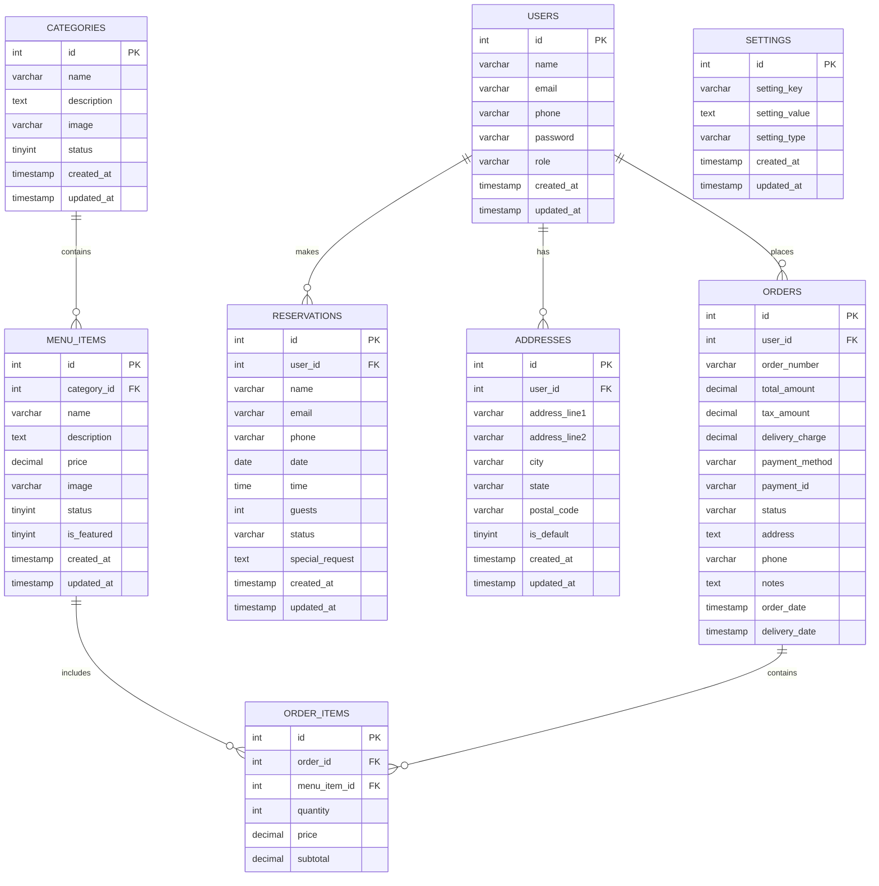

# HungryHeaven Database ERD

Below is the Entity Relationship Diagram for the HungryHeaven restaurant management system. This diagram shows all tables and their relationships.

## Mermaid ERD Code

## Relationship Details

1. **USERS to ORDERS**: One-to-Many
   - A user can place multiple orders
   - Each order belongs to a single user

2. **USERS to RESERVATIONS**: One-to-Many
   - A user can make multiple reservations
   - Each reservation belongs to a single user

3. **USERS to ADDRESSES**: One-to-Many
   - A user can have multiple addresses
   - Each address belongs to a single user

4. **CATEGORIES to MENU_ITEMS**: One-to-Many
   - A category can contain multiple menu items
   - Each menu item belongs to a single category

5. **MENU_ITEMS to ORDER_ITEMS**: One-to-Many
   - A menu item can be included in multiple order items
   - Each order item refers to a single menu item

6. **ORDERS to ORDER_ITEMS**: One-to-Many
   - An order can contain multiple order items
   - Each order item belongs to a single order

## How to View this ERD

To view this ERD as a diagram:

1. **GitHub**: If you paste this mermaid code in a GitHub markdown file, it will automatically render as a diagram.

2. **Mermaid Live Editor**: Visit [Mermaid Live Editor](https://mermaid.live/) and paste the code between the mermaid tags to visualize the diagram.

3. **VS Code**: Install a Mermaid extension like "Markdown Preview Mermaid Support" to view the diagram directly in VS Code.

4. **Export Options**: From the Mermaid Live Editor, you can export the diagram as SVG, PNG, or PDF for inclusion in your documentation.

## Database Implementation Notes

- All primary keys are auto-increment integers.
- Foreign keys maintain referential integrity between tables.
- Timestamps are used to track creation and modification dates.
- The settings table uses a key-value structure for application configuration.
- Status fields use predefined values (e.g., "pending", "completed", "cancelled") to track state.
