# HungryHeaven Site Structure

This document provides a comprehensive overview of the HungryHeaven application structure, including both the customer-facing website and the admin control panel.

## Site Map Diagram

```mermaid
graph TD
    %% Main Entry Points
    Main[Main Index Page]
    AdminLogin[Admin Login]
    
    %% Customer Section
    Main --> CustomerHome[Customer Homepage]
    CustomerHome --> CustomerMenu[Menu Browsing]
    CustomerHome --> CustomerAbout[About Us]
    CustomerHome --> CustomerContact[Contact]
    CustomerHome --> CustomerReservation[Table Reservation]
    
    %% Customer Account Flow
    CustomerHome --> CustomerLogin[Customer Login]
    CustomerLogin --> CustomerRegister[Customer Registration]
    CustomerLogin --> CustomerProfile[Customer Profile]
    CustomerProfile --> CustomerAddresses[Manage Addresses]
    CustomerProfile --> CustomerOrders[Order History]
    
    %% Order Flow
    CustomerMenu --> CustomerCart[Shopping Cart]
    CustomerCart --> CustomerCheckout[Checkout]
    CustomerCheckout --> CustomerPayment[Payment Options]
    CustomerPayment --> OrderComplete[Order Complete]
    CustomerPayment -->|Cash on Delivery| OrderComplete
    CustomerPayment -->|Razorpay| RazorpayGateway[Razorpay Gateway] --> OrderComplete
    
    %% Admin Section
    AdminLogin --> AdminDashboard[Admin Dashboard]
    
    %% Admin Menu Management
    AdminDashboard --> AdminCategories[Category Management]
    AdminCategories -->|Add| CategoryAdd[Add Category]
    AdminCategories -->|Edit| CategoryEdit[Edit Category]
    AdminCategories -->|Delete| CategoryDelete[Delete Category]
    
    AdminDashboard --> AdminMenuItems[Menu Item Management]
    AdminMenuItems -->|Add| MenuItemAdd[Add Menu Item]
    AdminMenuItems -->|Edit| MenuItemEdit[Edit Menu Item]
    AdminMenuItems -->|Delete| MenuItemDelete[Delete Menu Item]
    
    %% Admin Order Management
    AdminDashboard --> AdminOrders[Order Management]
    AdminOrders --> ViewOrder[View Order Details]
    AdminOrders --> UpdateStatus[Update Order Status]
    
    %% Admin Reservation Management
    AdminDashboard --> AdminReservations[Reservation Management]
    AdminReservations --> ApproveReservation[Approve Reservation]
    AdminReservations --> DeclineReservation[Decline Reservation]
    
    %% Admin Settings
    AdminDashboard --> AdminSettings[System Settings]
    AdminSettings --> GeneralSettings[General Settings]
    AdminSettings --> DeliverySettings[Delivery Settings]
    AdminSettings --> PaymentSettings[Payment Settings]
    AdminSettings --> TaxSettings[Tax Settings]
    AdminSettings --> SocialMediaSettings[Social Media Settings]
    
    %% Admin User Management
    AdminDashboard --> AdminUsers[User Management]
    AdminUsers --> AddAdmin[Add Admin User]
    AdminUsers --> EditAdmin[Edit Admin User]
    AdminUsers --> DeleteAdmin[Delete Admin User]
    
    %% Admin Reports
    AdminDashboard --> AdminReports[Reports]
    AdminReports --> SalesReport[Sales Reports]
    AdminReports --> OrderReport[Order Reports]
    AdminReports --> CustomerReport[Customer Reports]
    
    %% Admin Profile
    AdminDashboard --> AdminProfile[Admin Profile]
    AdminProfile --> UpdateAdminProfile[Update Profile]
    AdminProfile --> ChangePassword[Change Password]
    
    style Main fill:#f9f,stroke:#333,stroke-width:2px
    style AdminLogin fill:#bbf,stroke:#333,stroke-width:2px
    style AdminDashboard fill:#bbf,stroke:#333,stroke-width:2px
    style CustomerHome fill:#bfb,stroke:#333,stroke-width:2px
```



## Directory Structure

```
HungryHeaven/
├── admin/                  # Admin site files
│   ├── categories.php      # Category management
│   ├── dashboard.php       # Admin dashboard
│   ├── index.php           # Admin index redirect
│   ├── login.php           # Admin login
│   ├── logout.php          # Admin logout
│   ├── menu_items.php      # Menu management
│   ├── orders.php          # Order management
│   ├── profile.php         # Admin profile management
│   ├── register_admin.php  # Admin registration
│   ├── reports.php         # Sales/order reports
│   ├── reservations.php    # Reservation management
│   ├── settings.php        # System settings
│   └── users.php           # User management
│
├── customer/               # Customer site files
│   ├── about.php           # About us page
│   ├── addresses.php       # Address management
│   ├── cart.php            # Shopping cart
│   ├── checkout.php        # Order checkout
│   ├── contact.php         # Contact page
│   ├── index.php           # Customer home redirect
│   ├── login.php           # Customer login
│   ├── logout.php          # Customer logout
│   ├── menu.php            # Menu browsing
│   ├── orders.php          # Order history
│   ├── profile.php         # Customer profile
│   ├── register.php        # Customer registration
│   └── reservation.php     # Table reservations
│
├── includes/               # Shared files
│   ├── db_connection.php   # Database connection
│   ├── footer.php          # Footer template
│   ├── functions.php       # Common functions
│   ├── header.php          # Header template
│   └── navbar.php          # Navigation menu
│
├── assets/                 # Static assets
│   ├── css/                # CSS files
│   ├── images/             # Image files
│   └── js/                 # JavaScript files
│
├── uploads/                # Uploaded content
│   ├── categories/         # Category images
│   └── menu/               # Menu item images
│
├── index.php               # Main site entry
└── docs/                   # Documentation
```

## Admin Section Functionality

### Dashboard
- Overview of recent orders, sales stats, and key metrics
- Quick access links to all admin functions
- Visual graphs for sales performance

### Categories Management
- List all food categories with name, description, and image
- Add new categories with image upload functionality
- Edit existing categories
- Delete categories (with warning if contains menu items)

### Menu Items Management
- List all menu items with name, category, price, and status
- Add new menu items with image upload
- Edit existing menu items
- Toggle item availability status
- Delete menu items

### Order Management
- View all orders with filtering by status, date, and customer
- View detailed order information including customer details and order items
- Update order status (new, processing, ready, delivered, cancelled)
- Print/download order receipt

### Reservation Management
- View all table reservations with filtering by date and status
- Approve or decline reservation requests
- Send notification to customers about reservation status
- View reservation details

### Settings
- **General Settings**: Restaurant name, logo, contact info, business hours
- **Delivery Settings**: Delivery charge configuration, minimum order amount
- **Payment Settings**: Razorpay API key configuration, payment method availability
- **Tax Settings**: Configure tax percentage for orders
- **Social Media Settings**: Social media links for footer

### User Management
- List all administrative users
- Add new admin users with role assignment
- Edit existing admin users
- Delete admin users

### Reports
- Generate sales reports for selected date ranges
- View order volume by time period
- Export reports as PDF or CSV
- View popular menu items and categories

### Admin Profile
- View and edit personal information
- Change password
- View login history

## Access Control

The HungryHeaven system implements role-based access control:

1. **Customer Role**: Can access customer-facing pages only
2. **Admin Role**: Can access both admin panel and customer pages
3. **Super Admin Role** (optional): Can access all features including admin user management

Session variables track user authentication state:
- Admin sessions use `$_SESSION['admin_user_id']` and `$_SESSION['admin_user_role']`
- Customer sessions use `$_SESSION['user_id']` and `$_SESSION['user_role']`
